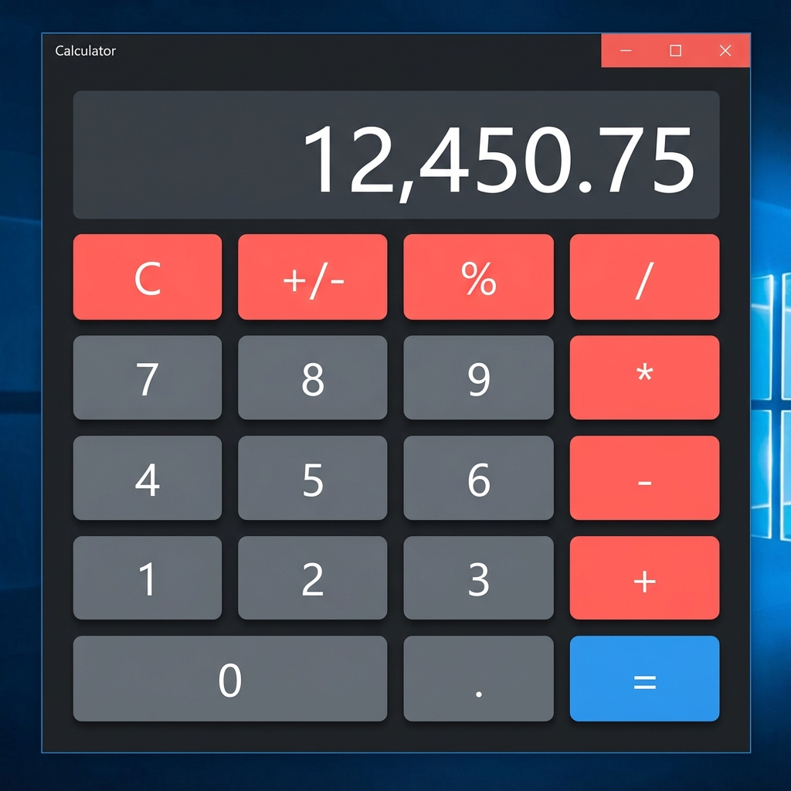

# 🧮 Koketso Swing Calculator



A simple yet vibrant Java Swing calculator application featuring basic arithmetic operations with a modern, clean GUI interface.

## ✨ Features

- **Modern Dark UI**: A sleek, dark-themed interface with high-contrast colors.
- **Vibrant Accents**: Neon-inspired buttons for operators and actions.
- **Standard Operations**: Addition, Subtraction, Multiplication, Division, and Modulo.
- **Hover Effects**: Interactive button states for better user experience.
- **Keyboard Support**: Standard numpad entry (via button clicks).

## 🚀 Getting Started

### Prerequisites

- Java Development Kit (JDK) 8 or higher.

### Installation

1. Clone the repository:
   ```bash
   git clone https://github.com/Raphasha27/koketso-swing-calculator.git
   ```
2. Navigate to the project directory:
   ```bash
   cd koketso-swing-calculator
   ```

### 🏃‍♂️ Running the Calculator

1. Compile the Java file:
   ```bash
   javac src/ModernCalculator.java
   ```
2. Run the application:
   ```bash
   java -cp src ModernCalculator
   ```

## 🛠️ Built With

- **Java Swing** - For the Graphical User Interface (GUI).
- **AWT** - For event handling and layout management.

## 🤝 Contributing

Contributions are welcome! Please feel free to open an issue or submit a pull request.

## 📝 License

This project is licensed under the MIT License.

---
*Developed by Raphasha27*
